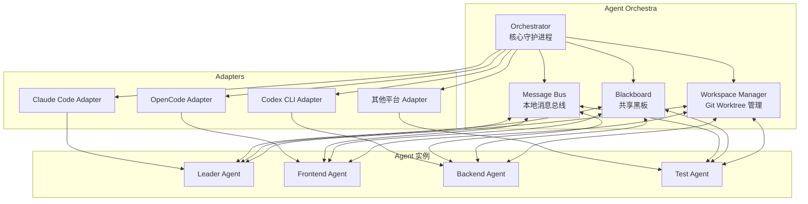

# Agent Orchestra

本地多 agent 协同编排工具，让订阅制 coding agent 真正相互通信、并行协作。

## 痛点与动机

当前大模型应用面临一个矛盾：

- **API 计费昂贵**：能力领先的大模型 API 按 token 计费，而写代码恰恰是 token 消耗大户；
- **订阅制 agent 崛起**：Claude Code、Codex CLI、OpenCode、Gemini CLI 等订阅制 coding agent 以固定月费提供同等甚至更强的能力；
- **多 agent 框架缺失**：市面上的多 agent 框架（MetaGPT、CrewAI、AutoGen 等）全部走 API 计费，而扣子、Cherry Studio 之类产品只是工作流编排或聊天客户端，都没有实现 coding agent 之间的真实相互通信。

Agent Orchestra 在这些订阅制 agent CLI 之上构建一个编排层：

1. **角色分配**：为每个 agent 实例分配角色（leader / 前端 / 后端 / 测试 / 评审……），角色用 YAML 声明式定义；
2. **真实通信**：通过本地消息总线让 agent 真正相互通信：leader 拆解任务并派活，worker 汇报进度，agent 之间可以互相提问和评审；
3. **并行协作**：通过共享黑板（任务板、决策日志、接口契约文档）+ git worktree 隔离工作区，让多个 agent 并行写码而不互相踩踏；
4. **统一适配**：适配层（adapter）统一封装各平台的无头模式（如 `claude -p --output-format stream-json`、`codex exec`、`opencode serve` 等）。

## 架构概览

**数据流向**：
- Orchestrator 负责回合调度、消息路由、配额感知
- Message Bus 实现 agent 间异步通信（SQLite 或 JSONL 追加日志）
- Blackboard 提供共享上下文（任务板、决策日志、接口契约）
- Workspace Manager 通过 git worktree 隔离各 agent 工作区

## 路线图

- **M0**：仓库脚手架与文档（当前）
- **M1**：第一个 adapter（Claude Code headless）+ 消息格式定稿 + CLI 单 agent 跑通一个任务
- **M2**：第二个 adapter（OpenCode 或 Codex CLI）+ leader-worker 双 agent 通信闭环
- **M3**：Blackboard 与 git worktree 工作区管理
- **M4**：TUI 监控面板 + 配额感知调度

详见 [docs/roadmap.md](docs/roadmap.md)。

## 多端开发

本项目支持 Mac 和 Windows 双端开发：

- **Mac 端**：即本仓库，直接开发；
- **Windows 端**：直接 `git clone`，换行符由 `.gitattributes` 统一为 LF，**不要**在 Windows 上设置 `core.autocrlf=true`；
- **SSH key**：两端各自生成 SSH key 并添加到 GitHub 账户；
- **协作习惯**：每次开始工作前 `git pull --rebase`，结束后及时 push；避免两端同时修改同一区域。

## 合规免责声明

本项目是个人与小团队的**本地**编排工具，利用使用者自己已付费的订阅额度。

**明确不做**：
- 不做账号池
- 不做订阅转售
- 不把订阅包装成对外 API 服务

使用本工具时，请遵守各 agent 平台的服务条款。本项目仅供学习和个人使用。

## 技术栈

- TypeScript / Node.js (>= 20)
- pnpm monorepo

## 许可证

[Apache-2.0](LICENSE)
