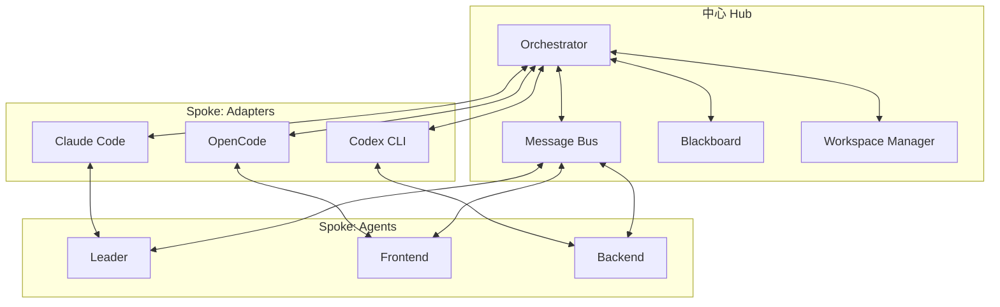
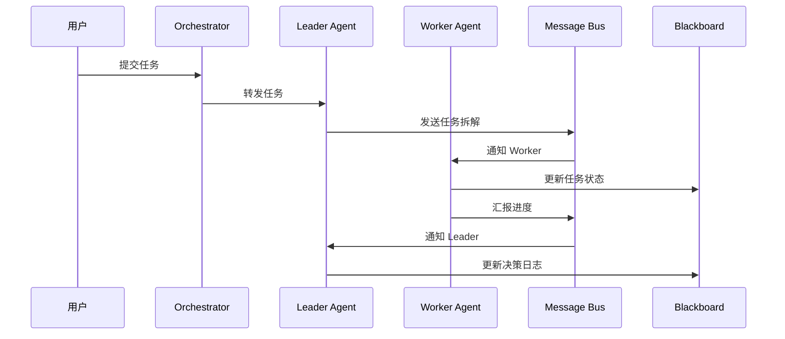

# 架构设计

本文档详细描述 Agent Orchestra 的 hub-and-spoke 架构。

## 整体架构

Agent Orchestra 采用 hub-and-spoke（中心辐射）架构，以 Orchestrator 为中心，协调多个 Adapter 和 Agent 实例。



## 核心组件

### 1. Orchestrator（核心守护进程）

Orchestrator 是系统的大脑，负责：

- **回合调度**：管理 agent 的执行顺序和并发控制
- **消息路由**：将消息从发送者路由到接收者
- **配额感知**：监控各平台订阅计划的用量窗口限制，实现排队与降级策略
- **生命周期管理**：启动、停止、重启 agent 实例

### 2. Adapter（平台适配器）

每个平台对应一个 Adapter，统一封装各平台的无头模式：

**统一接口**：
```typescript
interface AgentAdapter {
  start(config: AgentConfig): Promise<AgentSession>
  send(session: AgentSession, message: string): Promise<void>
  stream(session: AgentSession): AsyncIterable<AgentOutput>
  stop(session: AgentSession): Promise<void>
}
```

**适配的平台**：
- Claude Code：`claude -p --output-format stream-json`
- Codex CLI：`codex exec`
- OpenCode：`opencode serve`

**职责**：
- 登录态检测
- 版本兼容处理
- 输出格式标准化
- 错误处理与重试

> **注意**：各平台的接口细节以各平台官方文档为准，Adapter 层负责屏蔽差异。

### 3. Message Bus（消息总线）

本地消息总线，实现 agent 间的异步通信。

**存储方案**：SQLite 或 JSONL 追加日志

**消息 envelope 格式**：
```typescript
interface MessageEnvelope {
  id: string          // 消息唯一标识
  from: string        // 发送者 agent 名称
  to: string          // 接收者 agent 名称
  role: string        // 发送者角色
  type: MessageType   // 消息类型
  payload: unknown    // 消息内容
  ts: number          // 时间戳
}

type MessageType = 
  | 'task'      // 任务分配
  | 'report'    // 进度汇报
  | 'review'    // 评审请求
  | 'question'  // 提问
  | 'decision'  // 决策
```

**协议兼容**：
- envelope 设计向 A2A（Agent-to-Agent）协议靠拢
- 未来可做翻译层接入 ACP（Agent Communication Protocol）生态

### 4. Blackboard（共享黑板）

共享 markdown 黑板，解决各 agent 上下文窗口互相隔离、只靠消息会失真的问题。

**文件结构**：
- `TASKS.md`：任务板，记录任务分配和状态
- `DECISIONS.md`：决策日志，记录重要决策和原因
- `CONTRACTS.md`：接口契约，记录模块间接口定义

**使用方式**：
- Agent 可以读取黑板获取全局上下文
- Agent 可以写入黑板更新状态
- Orchestrator 负责黑板的并发控制

### 5. Workspace Manager（工作区管理器）

通过 git worktree 实现工作区隔离：

**核心功能**：
- 为每个 agent 分配独立的 git worktree 分支
- Leader 角色负责审查与合并
- 从机制上避免并发修改冲突

**工作流程**：
1. Orchestrator 为 agent 创建 worktree
2. Agent 在独立分支上工作
3. Agent 完成任务后通知 Leader
4. Leader 审查代码并合并到主分支

## 数据流

### 任务分发流程



### 消息流转示例

1. **任务分配**：Leader → Message Bus → Worker
2. **进度汇报**：Worker → Message Bus → Leader
3. **评审请求**：Worker → Message Bus → Leader
4. **决策记录**：Leader → Blackboard

## 扩展性

### 添加新平台

1. 实现 `AgentAdapter` 接口
2. 注册到 Orchestrator
3. 配置平台特定参数

### 自定义消息类型

1. 扩展 `MessageType` 枚举
2. 更新消息处理逻辑
3. 保持向后兼容

## 技术选型

| 组件 | 技术方案 | 理由 |
|------|---------|------|
| 消息存储 | SQLite / JSONL | 轻量、本地、无需额外服务 |
| 工作区隔离 | Git Worktree | 原生支持、无需额外工具 |
| 配置管理 | YAML | 声明式、易读 |
| 包管理 | pnpm | 高效、支持 monorepo |
